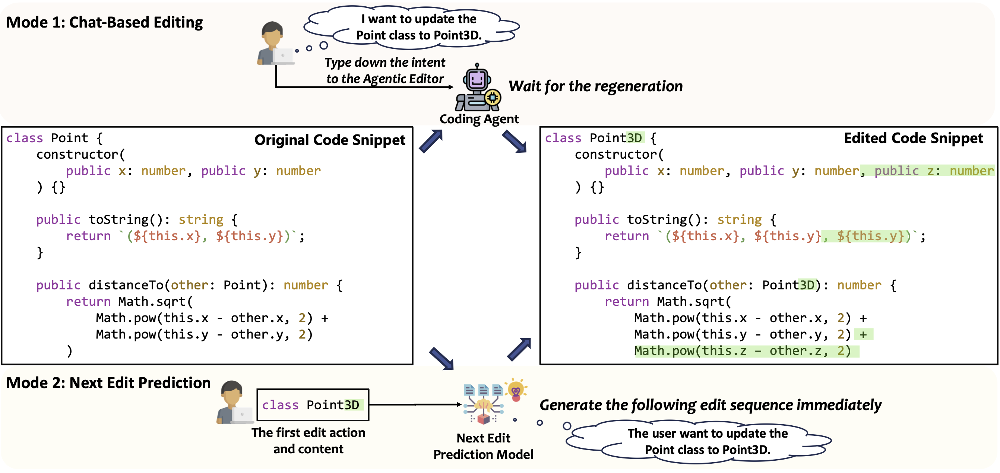

# Next Edit Prediction: Learning to Predict Code Edits from Context and Interaction History

<p align="center">
    <a href="https://arxiv.org/abs/2508.10074"></a>
    <a href="https://huggingface.co/datasets/lurf21/NextEditPrediction"></a>
</p>

## About
The rapid advancement of large language models (LLMs) has led to the widespread adoption of AI-powered coding assistants integrated into a development environment. On one hand, low-latency code completion offers completion suggestions but is fundamentally constrained to the cursor’s current position. On the other hand, chat-based editing can perform complex modifications, yet forces developers to stop their work, describe the intent in natural language, which causes a context-switch away from the code. This creates a suboptimal user experience, as neither paradigm proactively predicts the developer’s next edit in a sequence of related edits. To bridge this gap and provide the seamless code edit suggestion, we introduce the task of Next Edit Prediction, a novel task designed to infer developer intent from recent interaction history to predict both the location and content of the subsequent edit. Specifically, we curate a high-quality supervised fine-tuning dataset and an evaluation benchmark for the Next Edit Prediction task.


---
## Data Pipeline
The pipeline progresses through discrete stages:

1. **Filtering (`commitpack_filtering.py`)**
   - Loads language‑specific splits.
   - Applies safety & brevity filters: max characters (pre‑token guard), token length (`tiktoken`), edit chunk count, per‑chunk length, window size.
   - Persists filtered per‑language JSONL to a Hugging Face dataset repo.

2. **Labeling (`commitpack_labeling.py`)**
   - Builds classification prompts with positive & negative examples.
   - Uses GPT (`gpt-4o-mini` in code) asynchronously to answer yes/no: *Are the edit chunks relevant?*
   - Adds a `label` field.

3. **Processing (`commitpack_processing.py`)**
   - Filters to `label == 1`.
   - Removes the last chunk to create an *intermediate* `current_contents` (simulating partial progress).
   - Builds final `text` field containing the multi‑section training prompt.
   - Saves processed `train.jsonl`.

---
## Finetuning
We use Modal for fine-tuning and evaluation of models. See [Modal](https://modal.com/) for more details. Once you have set up Modal, you can run `fintuning/lora.py` through the following command:
```bash
modal run finetuning/lora.py
```

Our fine-tuned models are available on Hugging Face:

| Model                         | Checkpoint                                                   |
| ----------------------------- | ------------------------------------------------------------ |
| Qwen2.5-Coder-3B-NEP          | 🤗 [HF Link](https://huggingface.co/lurf21/Qwen2.5-Coder-3B-NEP) |
| Qwen2.5-Coder-7B-NEP          | 🤗 [HF Link](https://huggingface.co/lurf21/Qwen2.5-Coder-7B-NEP) |
| Qwen2.5-Coder-14B-NEP         | 🤗 [HF Link](https://huggingface.co/lurf21/Qwen2.5-Coder-14B-NEP) |
| Qwen2.5-Coder-32B-NEP         | 🤗 [HF Link](https://huggingface.co/lurf21/Qwen2.5-Coder-32B-NEP) |
| CodeGemma-2B-NEP              | 🤗 [HF Link](https://huggingface.co/lurf21/codegemma-2b-NEP)  |
| CodeGemma-7B-NEP              | 🤗 [HF Link](https://huggingface.co/lurf21/codegemma-7b-NEP)  |
| Codestral-22B-NEP             | 🤗 [HF Link](https://huggingface.co/lurf21/Codestral-22B-v0.1-NEP) |
| Qwen2.5-Coder-7B-Instruct-NEP | 🤗 [HF Link](https://huggingface.co/lurf21/Qwen2.5-Coder-7B-Instruct-NEP) |
| CodeGemma-7B-it-NEP           | 🤗 [HF Link](https://huggingface.co/lurf21/codegemma-7b-it-NEP) |

---
## Inference

### Offline / Local (vLLM)
Runs selected SFT (`*-NEP`) and base models with greedy decoding (`temperature=0`).
```bash
modal run evaluate/generate_offline.py
```

### API Based 
Calls multiple LLMs concurrently using asyncio. Requires environment variables for each provider.
```bash
python evaluate/generate_api.py
```

---
## Evaluation
1. **LLM-as-a-Judge** (`evaluate/llm_as_a_judge.py`):
   ```bash
   python evaluate/llm_as_a_judge.py
   ```
   Produces: `llm_as_a_judge_results/<model>_llm_as_a_judge_results.jsonl` with yes/no responses.

2. **Metric Aggregation** (`evaluate/evaluate.py`):
   ```bash
   python evaluate/evaluate.py
   ```
   Consumes original test set + generation + judge outputs, computes metrics & summary CSV.

---
## Environment Variables & Secrets
Modal secret names (configure on platform):
- `huggingface-secret` → provides `HF_TOKEN`
- `openai-secret` → provides `OPENAI_API_KEY`
- `wandb-secret` → provides `WANDB_API_KEY`

Local `.env` (for API generation & judging):
```
OPENAI_API_KEY=...
ANTHROPIC_API_KEY=...
GEMINI_API_KEY=...
DEEPSEEK_API_KEY=...
HF_TOKEN=...
WANDB_API_KEY=...
```

---
### Citation
```
@misc{lu2025editpredictionlearningpredict,
      title={Next Edit Prediction: Learning to Predict Code Edits from Context and Interaction History}, 
      author={Ruofan Lu and Yintong Huo and Meng Zhang and Yichen Li and Michael R. Lyu},
      year={2025},
      url={https://arxiv.org/abs/2508.10074}, 
}
```
